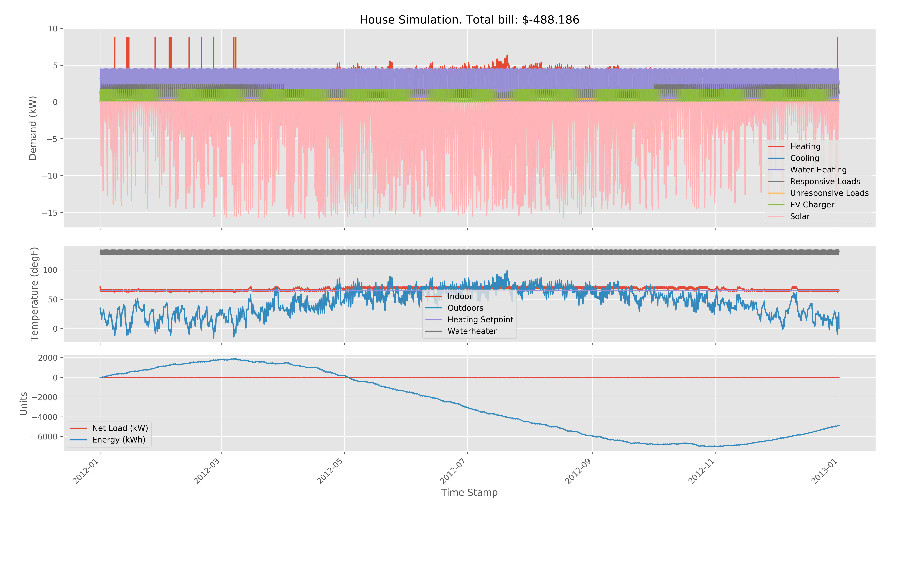

## Net Zero Energy House Simulator

This simulates a house with added, solar and energy storage that (to my surprise) make it net zero energy. It's also got an electric vehicle. By default it uses weather data from Vermont.

Eventually I'll try to aggregate a bunch of these together to look at regional and national building energy. But that's a lot harder than just whipping up a little python and gridlabd stuff.

Here's what the output looks like:



## What's Part of the Simulation?

```
                    | --- ev charger
                    | --- waterheater
meter --- house --- | --- responsive loads (washing machine, dryer, dishwasher, ...)
  |                 | --- unresponsive loads (lights, TV, other plug loads, ...)
  |
  | --- inverter --- battery
  | --- inverter --- solar
```

## Installation and Use

First you'll need to install the prerequisites: [Python](https://www.python.org/downloads/), [gridlabd](https://sourceforge.net/projects/gridlab-d/), and matplotlib (`pip install matplotlib`).

Then do a `git clone XXX` or just download the thing.

## Things That Are Fun To Play With

TBD

## Aggregation
- Consumer Level (done)
- Neighborhood, distribution, transmission operator (kinda boring)
- ISO (interesting)

## Todo Consumer Level
- XXX A little bit of plotting.
- XXX Additional devices? See superHouse.glm.
- XXX Switch to superHouse.glm.
- XXX Parse and display datetimes correctly.
- XXX chart all the loads.
- XXX chart the generation as negative load.
- XXX Hey, uh what are the gridlab-d attributes? gridlabd --modhelp residential; gridlabd --modhelp gernea
- XXX Units on all variables out of GridLAB-D.
- XXX Bill in dollars.
- XXX Try a second climate? Gave some more TMY2 options. You could also grab a new [TMY3 file](https://rredc.nrel.gov/solar/old_data/nsrdb/1991-2005/tmy3/by_state_and_city.html).
- XXX Clean up subplots.
- OOO What about scheduling and using the battery?

## Todo ISO Level
- OOO Need a graph with weighted edges.
	- https://www.eia.gov/realtime_grid/#/status?end=20160722T00
	- http://konect.uni-koblenz.de/networks/opsahl-powergrid
	- https://www.nrel.gov/analysis/re-futures.html
	- https://www.google.com/search?q=graph+of+us+electric+grid&client=safari&rls=en&tbm=isch&source=iu&ictx=1&fir=5dyQqhvqwy2ssM%253A%252CJ4loAimiIQ9GJM%252C_&usg=AI4_-kQBcBwleihJY_HT1W1aQYwoZa4zDw&sa=X&ved=2ahUKEwi_9OLRicHgAhVqTd8KHVtACFcQ9QEwAHoECAAQBA#imgrc=ttnQV1kaMLgOLM
	- https://techcrunch.com/2019/02/15/how-to-decarbonize-america-and-the-world/
- OOO Put it on a map.
- OOO Need renewables supply.
