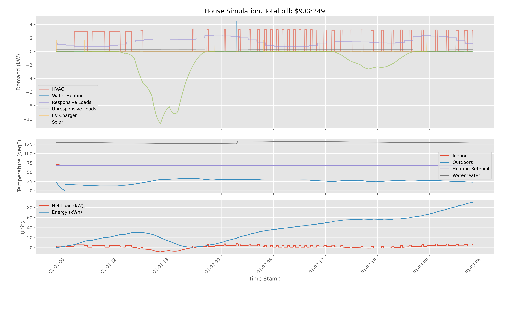

## Net Zero Energy House Simulator

Simulate a house with added solar and energy storage. It's also got an electric vehicle. By default it uses weather data from Vermont.

Eventually I'll try to aggregate a bunch of these together to look at regional and national building energy. But that's a lot harder than just whipping up a little python and gridlabd.

Here's what the output looks like, a summary of consumption, generation, temperatures, and total cost:



## What's Part of the Simulation?

```
                    | --- ev charger
                    | --- waterheater
meter --- house --- | --- responsive loads (washing machine, dryer, dishwasher, ...)
  |                 | --- unresponsive loads (lights, TV, other plug loads, ...)
  |
  | --- inverter --- battery
  | --- inverter --- solar
```

## Installation and Use

First you'll need to install the prerequisites: [Python](https://www.python.org/downloads/), [gridlabd](https://sourceforge.net/projects/gridlab-d/), and matplotlib (`pip install matplotlib`).

Then do a `git clone https://github.com/dpinney/NetZeroEnergyHouseSim.git` or just [download the thing](https://github.com/dpinney/NetZeroEnergyHouseSim/archive/master.zip).

The main outputs are in [out_all_charts.png](./out_all_charts.png), and they're regenerated when you run `python consumerSim.py`. The .csv outputs are also regenerated and are all named "out_....csv".

## Things That Are Fun To Play With

Edit in_superHouse.glm and change:

1. The timespan of the simulation by editing the clock object starting on line 1.
2. The climate, defined on line 30, can be switched to other the cities using files in_climates....csv or any [TMY3 file](https://rredc.nrel.gov/solar/old_data/nsrdb/1991-2005/tmy3/by_state_and_city.html).
3. Insulation, square footage, heating system type, etc. for the house starting on line 47.
4. Specs on the solar system starting on line 151.
5. The energy storage system, which I confess I haven't really put on a schedule for charging/discharging, starting on line 182.
6. Probably other things. Gridlabd includes a full distribution system simulator, so you can build a neighborhood of houses. Or play with wind generation. Or gas. Or thermal storage.

In general, the gridlabd objects are tricky, but you can get most of the available options from the documentation for the [residential module](http://gridlab-d.shoutwiki.com/wiki/Residential_(module)) and the [generators module](http://gridlab-d.shoutwiki.com/wiki/Generators_(module)).

## Aggregation
- Consumer Level (done)
- Neighborhood, distribution, transmission operator (kinda boring, renewables will have about the same output)
- ISO (interesting)

## Todo Consumer Level
- XXX A little bit of plotting.
- XXX Additional devices? See superHouse.glm.
- XXX Switch to superHouse.glm.
- XXX Parse and display datetimes correctly.
- XXX chart all the loads.
- XXX chart the generation as negative load.
- XXX Hey, uh what are the gridlab-d attributes? gridlabd --modhelp residential; gridlabd --modhelp gernea
- XXX Units on all variables out of GridLAB-D.
- XXX Bill in dollars.
- XXX Try a second climate? Gave some more TMY2 options. You could also grab a new [TMY3 file](https://rredc.nrel.gov/solar/old_data/nsrdb/1991-2005/tmy3/by_state_and_city.html).
- XXX Clean up subplots.
- OOO What about scheduling and using the battery?

## Todo ISO Level
- OOO Need a graph with weighted edges.
	- https://www.eia.gov/realtime_grid/#/status?end=20160722T00
	- http://konect.uni-koblenz.de/networks/opsahl-powergrid
	- https://www.nrel.gov/analysis/re-futures.html
	- https://www.google.com/search?q=graph+of+us+electric+grid&client=safari&rls=en&tbm=isch&source=iu&ictx=1&fir=5dyQqhvqwy2ssM%253A%252CJ4loAimiIQ9GJM%252C_&usg=AI4_-kQBcBwleihJY_HT1W1aQYwoZa4zDw&sa=X&ved=2ahUKEwi_9OLRicHgAhVqTd8KHVtACFcQ9QEwAHoECAAQBA#imgrc=ttnQV1kaMLgOLM
	- https://techcrunch.com/2019/02/15/how-to-decarbonize-america-and-the-world/
- OOO Put it on a map.
- OOO Need renewables supply.
